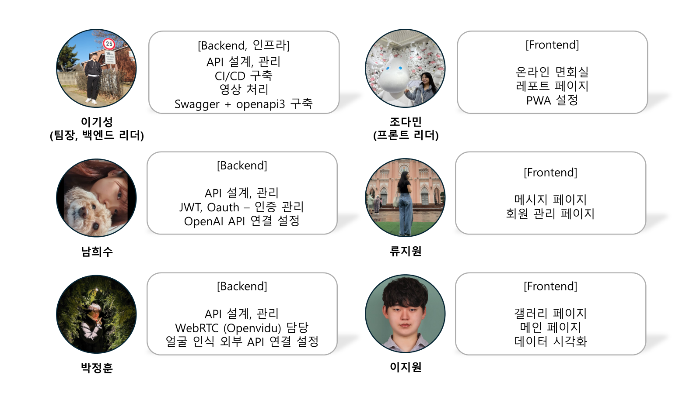

    

#### 보호자와 요양원 사이의 원활한 소통을 돕는 서비스

    <a href="#video">Video</a> • 
    <a href="#features">Features</a> •
    <a href="#contributors">Contributors</a> •
    <a href="#project-output">Project Output</a> •
    <a href="https://www.notion.so/daminzziA601-71f81b9d61484dc99e9e549473288b04">Notion</a>

## 뷰케어풀

### 배경

요양원에서의 생활은 입소자 뿐만 아니라 그 가족과 간병인들에게도 많은 고민을 안겨줍니다.
특히 코로나 이후 화상면회의 필요성이 더욱 커졌지만, 기존에는 적합한 플랫폼이 없어 개별 연락을 통해 번거로운 스케줄 조율을 하고 있었습니다.

`뷰케어풀`은 요양원 생활에 특화된 편리한 소통 플랫폼으로, 입소자의 생활정보, 식단, 건강정보를 효율적으로 관리할 수 있으며,
메시지와 화상면회 기능을 통해 언제든지 소통이 가능합니다.

`뷰케어풀`은 코로나 이후 더욱 필수적인 화상면회의 요구를 충족시키며,
가족과 간병인들에게는 소통의 불편함을 해소하여 보다 가까운 관계를 형성할 수 있도록 돕습니다.

### 개발기간

2024.01.08 ~ 2024.02.15 (6주)

## Video

## Features

### 온라인 화상 면회

- 화상 면회 예약 시스템
- 면회 중 입소자의 표정 인식을 통해 베스트샷으로 찍어 갤러리에 자동 저장

### 일일리포트 조회

- 원하는 날짜의 하루 건강 정보 조회
- 평균 혈당 및 혈압, 식단 조회
- 간병인이 입력한 입소자의 컨디션 조회

### 월간 리포트 조회

- 온라인 화상 면회 중 베스트샷 기능 기반의 추억 영상 자동 생성 후 제공
- Open AI를 사용한 한달간 입소자의 건강 및 생활 정보 요약 리포트 제공

## Contributors

## Project Output

#### <a href="files/01_기능정의서.xlsx">기능정의서</a>
#### 시스템 아키텍처

#### ERD

#### <a href="https://www.notion.so/daminzziAPI-Docs-c338583e13774ea8b891a94485b7817c">api 명세서</a>

